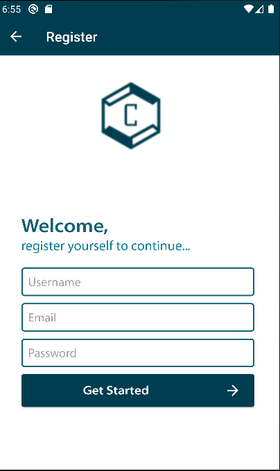
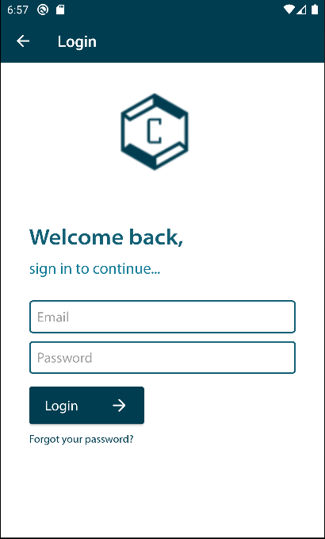
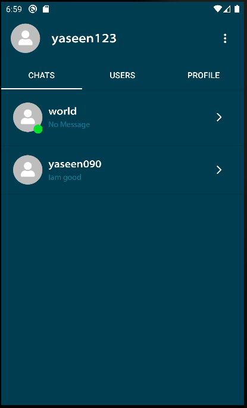
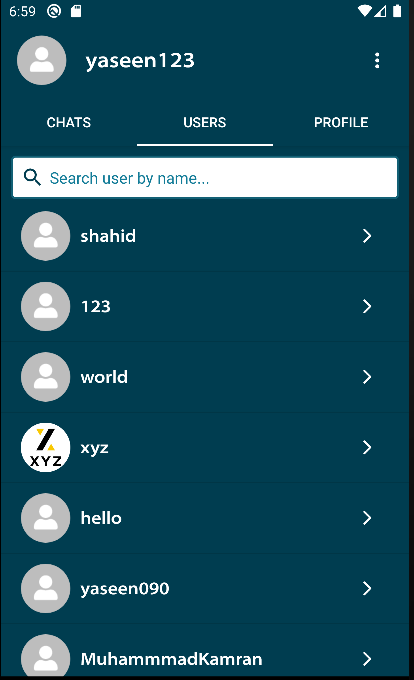
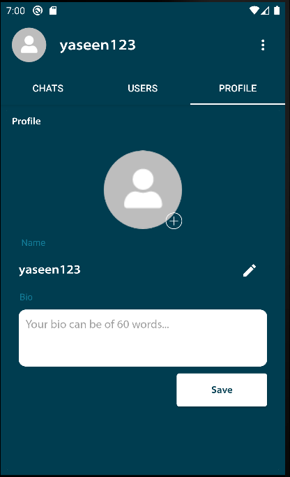
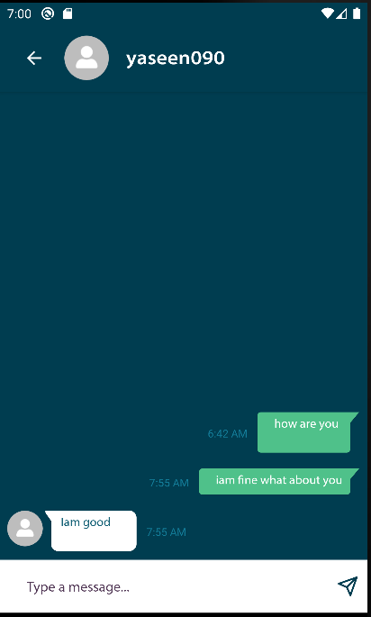

## About
“Connectify” is an social media android Application to connect with every person that signs up on this app. Users who have an android phone & active internet connection can contact and start chatting with other people easily through this application. The purpose of this application is to help bring people together 

## Features
Easy and Fast Messaging between Users 
#
Included:
User Databases
User Login & Sign up
User Details
Finding Users easily
## Tools Used
Firebase Database
Firebase Authentication
Android Studio IDE

## How to install?
You can install this application by downloading the APK file in the repository and install it in your android Device.

## Preview:
 
 
 
 
 
 
 

Thanks
